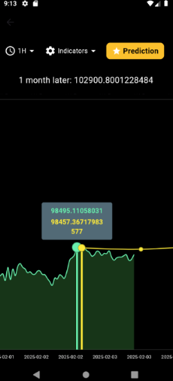

# 💹 Crypto World

**Crypto World** is a powerful, AI-driven crypto market analysis platform. It provides real-time data, technical indicators, anomaly detection, and deep learning-based price prediction. The project is designed to support both casual users and experienced traders by delivering clear insights and interactive tools.

---

## 🎥 Demo Video

> Click the image above to watch a short demo of Crypto World in action.

---

## 🖼️ Screenshots

| Home Page | Fullscreen Chart |
|-----------|------------------|
|  |  |

| RSI & Bollinger Bands | Anomaly Detection |
|------------------------|------------------|
|  |  |

| AI Price Prediction | Coin Details |
|---------------------|--------------|
|  |  |

---

## 🧠 Key Features

- 📈 **Real-time Coin Data**: Live updates using external APIs.
- 🧮 **Technical Indicators**: RSI, Bollinger Bands, and Moving Averages.
- 📊 **Fullscreen Charts**: Interactive and expandable charting for better visualization.
- ⚠️ **Anomaly Detection**: Detects sudden drops or spikes in coin values in real-time.
- 🤖 **AI Price Prediction**: Predicts future prices for the next 30 days using a TensorFlow-based deep learning model.
- 🔗 **Backend Integration**: Python FastAPI via Ngrok is used to serve the trained AI model.
- 📉 **Detailed Coin View**: With key metrics and analysis.

---
